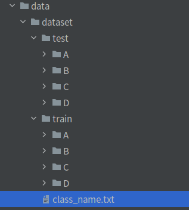

# PyTorch-Classification-Trainer

## 1.Introduction

Image classification pipeline based on PyTorch, the training framework uses `Pytorch-Base-Trainer (PBT)`.
The entire training code is very simple to operate. Users only need to put data of the same category in the same directory and fill in the corresponding data path to start training.

- Github: Pytorch-Base-Trainer: [Pytorch distributed training framework](https://github.com/PanJinquan/Pytorch-Base-Trainer)
- pip installation package： [basetrainer](https://pypi.org/project/basetrainer/)


## 2.Install
- Depends on Python packages：[requirements.txt](./requirements.txt)

```bash
# (1) Install Anaconda3
# (2) Create a new virtual environment pytorch-py36 in conda (if it already exists, no need to create a new one)
conda create -n pytorch-py36 python==3.6.7
# (3) Activate the virtual environment pytorch-py36 (need to run each time)
conda activate  pytorch-py36
# (4) Install the project dependent packages (if already installed, no need to install)
pip install -r requirements.txt
```

## 3.Data: Prepare Train and Test data

- The Train and Test datasets require that images of the same category be placed in the same folder; and the sub-directory folders be named after the category name.
  


- Category file: one list per line: [class_name.txt](data/dataset/class_name.txt) (Please enter the last line).


- Modify the configuration file data path: [config.yaml](configs/config.yaml).
```yaml
train_data: # Multiple datasets can be added
  - 'data/dataset/train' 
  - 'data/dataset/train2'
test_data: 'data/dataset/test'
class_name: 'data/dataset/class_name.txt'
```

## 4.Train
```bash
python train.py -c configs/config.yaml 
```

- The target supports backbones such as googlenet, inception_v3, resnet[18,34,50], mobilenet_v2, etc.See [backbone](classifier/models/build_models.py) for details，Other backbones can be customized and added.
- Training parameters can be configured through the configuration file. [config.yaml](configs/config.yaml)

| **参数**      | **类型**      | **参考值**   | **说明**                                       |
|:-------------|:------------|:------------|:---------------------------------------------|
| train_data   | str, list   | -           | Training data file, can support multiple files                |
| test_data    | str, list   | -           | Testing data file, can support multiple files                    |
| class_name   | str         | -           | Class file                               |
| work_dir     | str         | work_space  | Training output workspace                                     |
| net_type     | str         | resnet18    | Backbone type, {resnet18/34/50,mobilenet_v2,googlenet,inception_v3} |
| input_size   | list        | [128,128]   | Model input size [W,H]                                  |
| batch_size   | int         | 32          | batch size                                   |
| lr           | float       | 0.1         | Initial learning rate size                                      |
| optim_type   | str         | SGD         | Optimizer, {SGD,Adam}                               |
| loss_type    | str         | CELoss      | Loss Function                                         |
| scheduler    | str         | multi-step  | Learning rate adjustment strategy, {multi-step,cosine}                  |
| milestones   | list        | [30,80,100] | Nodes that reduce the learning rate are only valid when scheduler=multi-step           |
| momentum     | float       | 0.9         | SGD Momentum Factor                                      |
| num_epochs   | int         | 120         | Number of circuit training sessions                                      |
| num_warn_up  | int         | 3           | Number of warn_up                                   |
| num_workers  | int         | 12          | Number of DataLoader threads enabled                              |
| weight_decay | float       | 5e-4        | Weight attenuation coefficient                                       |
| gpu_id       | list        | [ 0 ]       | Specify the GPU card number for training. You can specify multiple                             |
| log_freq     | in          | 20          | Frequency of displaying LOG information                                   |
| finetune     | str         | model.pth   | finetune the model                                  |
| progress     | bool        | True        | Whether to display a progress bar                                      |
| distributed  | bool        | False       | Whether to use distributed training                                    |

## 5.Testing Demo

- (1) Revising [demo.py](demo.py)

```python configuration file
def get_parser():
    # Configuration file
    config_file = "configs/config.yaml"
    # Model file
    model_file = "work_space/mobilenet_v2/model/latest_model_099_97.5248.pth"
    # Directory of images to be tested
    image_dir = "data/test_image"
    parser = argparse.ArgumentParser(description="Inference Argument")
    parser.add_argument("-c", "--config_file", help="configs file", default=config_file, type=str)
    parser.add_argument("-m", "--model_file", help="model_file", default=model_file, type=str)
    parser.add_argument("--device", help="cuda device id", default="cuda:0", type=str)
    parser.add_argument("--image_dir", help="image file or directory", default=image_dir, type=str)
    return parser
```

- (2) running demo.py

```bash
python demo.py
```

## 6.Visualization

Currently, the training process visualization tool is Tensorboard, which can be used as follows:

```bash
tensorboard --logdir=path/to/log/
```

